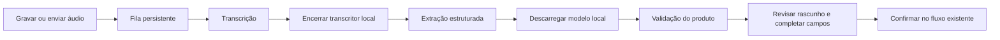

# Planejamento — lançamento por áudio com IA

Data: 2026-10-10. Estado: proposta para discussão; sem implementação, instalação
ou alterações de infraestrutura. O requisito confirmado é aceitar self-hosted
ou provedores externos e não manter modelos locais ocupando RAM continuamente.
Dimensionamento depende dos recursos disponíveis no ambiente de implantação,
da latência aceitável e do compartilhamento dos serviços de inferência. O produto
não exige uma máquina, hipervisor ou configuração de VM específicos.

## Resultado de produto proposto

O usuário grava/envia um áudio, acompanha o processamento e recebe um formulário
preenchido de abastecimento, manutenção ou documentação. Confere os dados,
corrige o necessário e confirma pelo fluxo de registro existente.

Exemplo: “Abasteci o Civic hoje, 35 litros de gasolina, deu duzentos e dez reais,
o painel está em oitenta e dois mil quilômetros, enchi o tanque”. Rascunho:
veículo Civic, data civil do envio, 35 L, BRL 210,00, km 82000, tanque cheio.
Preço unitário 6,00 calculado pelo produto. Ausência da frase “enchi o tanque”
não autoriza presumir tanque cheio; o formulário pede essa informação.

A gravação automática sem revisão permanece uma decisão pendente. Minha
recomendação para o MVP é confirmação obrigatória, especialmente para números,
veículo, moeda e odômetro. Uma nota de confiança inventada pelo modelo não deve
ser usada para decidir que uma transação financeira pode ser gravada sozinha.

Fluxo sugerido:



O usuário pode sair da tela e voltar depois. A UI mostra etapas (“Na fila”,
“Carregando modelo”, “Transcrevendo”, “Interpretando”, “Pronto para revisar”),
sem estimativas de porcentagem ou tempo que não tenham medição real.

## MVP proposto — decisões a aprovar

- Um áudio gera um lançamento. Se houver múltiplas ações, informar a limitação;
  nunca salvar apenas parte da fala silenciosamente. Múltiplos rascunhos ficam
  para uma evolução deliberada.
- Sugestão inicial: até dois minutos e 15 MB, com gravação no browser e upload
  de arquivo. São propostas, não limites já aprovados.
- Contexto escolhido na garagem/veículo ajuda na identificação. Havendo dois
  carros chamados Civic ou nenhuma indicação suficiente, perguntar ao usuário.
- Suportar abastecimento, manutenção de total direto e documentação. Analisar
  itens detalhados, seguros/outros e vínculo com lembretes em fases seguintes.
- Campo ausente = null/pendência. “Ontem” usa a data civil do envio, preservada
  junto ao job; processar amanhã não muda o significado. Fuso deve ser capturado
  pelo app. Modelo recebe a referência de data explicitamente.
- Valores monetários saem como strings decimais, nunca floats. Cálculos de
  total/preço por litro, arredondamento e coerência do odômetro são do domínio
  existente. Autoria é o usuário autenticado que confirma, com autor do áudio
  registrado separadamente para auditoria.
- Provedor e modelo são escolhidos explicitamente para transcrição e extração.
  Sem fallback externo silencioso quando o servidor local estiver indisponível.

## Contratos e configuração dos provedores

Separar as duas capacidades, sem assumir que um provedor atende a ambas:

| Etapa | Contrato interno | Adaptadores previstos |
| --- | --- | --- |
| Transcrição | áudio + idioma/contexto → texto, segmentos/avisos | whisper.cpp local, servidor STT configurado, provedores externos compatíveis |
| Extração | texto + contexto restrito + schema → rascunho | Ollama, OpenAI, Anthropic, Bedrock e servidores compatíveis |

O contrato comum não significa que todos usem a mesma API. Cada adaptador
traduz autenticação, transporte, schema e erros. Provedores sem capacidade de
transcrição não aparecem nessa seleção. Bedrock pode exigir região/perfil IAM
em vez de uma simples API key.

Proposta de configuração: administrador da instância cadastra provedores e
credenciais; garagem escolhe entre opções autorizadas. Alternativa: uma única
configuração global no primeiro MVP. Escopo e UI ainda serão aprovados.
Credenciais ficam no backend; o browser só acessa a API do FleetLog. Endpoints
self-hosted precisam de política de acesso definida, pois fazem o backend
conectar-se à rede do homelab. Não oferecer URLs arbitrárias a qualquer membro.

Congelar por job versão do schema/prompt, modelo/tag e configuração usada,
sem gravar segredo no snapshot. Trocas de configuração não mudam um job em curso.
A confirmação usa o draft revisado, não depende de executar o modelo novamente.

## Fila, armazenamento e recuperação

Proposta: usar PostgreSQL existente para jobs/etapas e S3 privado para o áudio.
Isso evita exigir Redis/RabbitMQ antes de existir uma demanda que justifique.

Estados internos:
`queued → transcribing → extracting → needs_input/ready → confirmed`.
Também `retry_wait`, `failed`, `cancelled`, `expired`. A UI pode distinguir
carregamento de modelo dentro da etapa, sem persistir estados inconsistentes.

Worker serial para o homelab: claim com lease e `FOR UPDATE SKIP LOCKED`,
heartbeat, limite de tentativas e backoff. Após reinício, jobs com lease vencido
voltam a uma etapa recuperável. Transcrição concluída é preservada: falhar na
extração não obriga retranscrever o áudio. Timeout deve aceitar cold start e
separar falha de conexão, carregamento e inferência.

- Job/draft tem garagem e autor, com autorização em leitura, alteração e confirmação.
- Política de visibilidade do rascunho: propor somente autor no MVP; compartilhar
  com familiares exige decisão explícita. O lançamento confirmado continua
  seguindo as permissões existentes da garagem.
- Upload validado por conteúdo, duração e tamanho. Converter para o formato do
  transcritor em processo controlado, sem interpolar a fala em comandos de shell.
- Cancelamento interrompe a etapa quando o adaptador permitir e sempre impede
  a confirmação posterior do job cancelado. Uma resposta atrasada não ressuscita job.
- Idempotência por envio e confirmação; transação de confirmação liga job à entrada
  criada e marca confirmed. Repetir após perda da resposta retorna a mesma entrada.
- Refatorar a criação existente para um serviço de domínio reaproveitável, com
  validações, audit trail, odômetro e permissões. A IA não recebe acesso SQL/tools.
- Excluir áudio após confirmação/cancelamento/expiração, conforme retenção aprovada.
  Falhas de limpeza têm retry. Transcrição/rascunho também precisam de retenção.
- Definir cotas por usuário/garagem, TTL e quando falhas exigem tentativa manual.

## Memória local — desenho recomendado

O processo de STT roda sob demanda e termina antes da extração. Assim o modelo
de fala não precisa coexistir em memória com o LLM. Para primeira implementação
local, whisper.cpp em subprocesso é uma alternativa simples de gerenciar esse
ciclo; um servidor Whisper permanente precisaria de sua própria política de
unload. O keep_alive do Ollama não descarrega modelos de outro serviço.

Para o LLM, começar com **unload após cada job**. Evitar pré-carregamento em
health checks ou chamadas ociosas que executem inferência. Chamadas de status
não devem esquentar o modelo. Arquivos ficam em disco entre os jobs.

A API do Ollama aceita `keep_alive: 0` para descarregar após a resposta. Pode
usar `OLLAMA_KEEP_ALIVE=0` como padrão, mas o valor enviado na chamada prevalece.
Contexto e paralelismo aumentam memória; começar com contexto 4096, paralelismo
1 e apenas um modelo carregado. [FAQ oficial](https://docs.ollama.com/faq)

Configuração proposta, não aplicada neste projeto/homelab:

```dotenv
OLLAMA_KEEP_ALIVE=0
OLLAMA_NUM_PARALLEL=1
OLLAMA_MAX_LOADED_MODELS=1
OLLAMA_CONTEXT_LENGTH=4096
```

Na chamada nativa `/api/chat`, enviar `stream: false`, o JSON Schema em `format`,
`keep_alive: 0` e limites de contexto/saída. Usar temperatura baixa, sem concluir
que isso elimina erros. [API chat](https://docs.ollama.com/api/chat),
[Structured Outputs](https://docs.ollama.com/capabilities/structured-outputs)

Alternativa futura: manter o modelo por 30–60 segundos para amortizar um lote,
se o usuário aceitar essa janela; descarregar quando a fila esvaziar. Isso requer
coordenação quando o Ollama for compartilhado com outros serviços. FleetLog
não deve executar um stop indiscriminado que interrompa trabalhos de terceiros.

Descarregar pesos reduz o uso de RAM/VRAM do modelo; o daemon do Ollama ainda
consome recursos e o SO pode manter cache de arquivos recuperável. “Modelo
fora da memória” não promete consumo zero do serviço. `ollama ps` ajuda a
verificar residência. [FAQ oficial](https://docs.ollama.com/faq)

Se até o daemon ocioso for indesejado, iniciar/parar o serviço sob demanda é
uma opção de infraestrutura separada. Exige supervisor e política de saúde;
não dar ao FleetLog acesso amplo ao Docker socket para resolver isso.

## Candidatos para avaliação

| Etapa | Primeiro candidato | Alternativa | O que medir |
| --- | --- | --- | --- |
| Fala em português | Whisper small multilingual via whisper.cpp | base multilingual se CPU/memória forem apertadas; faster-whisper para outro runtime | números, nomes de peças, ruído, cold start, RSS e duração |
| Extração textual | qwen3:4b-instruct-2507-q4_K_M no Ollama | qwen3:8b se 4B não atingir qualidade e houver folga | campos exatos, ambiguidades, schema, RSS/VRAM e tempo |

São hipóteses de teste, não promessa de que um modelo atende ao produto.
Escolhi o Instruct pequeno como baseline de extração curta; não precisamos de
um contexto enorme ou reasoning longo para preencher campos.

A tag 4B citada tem artefato de 2,5 GB. Tamanho em disco não é RAM necessária:
contexto, buffers e runtime adicionam consumo. A escolha definitiva exige medir
na máquina informada. [Tag oficial Qwen](https://ollama.com/library/qwen3:4b-instruct-2507-q4_K_M)

A documentação do whisper.cpp estima ~388 MB para base e ~852 MB para small,
com variação de runtime/quantização/hardware. Usar versões multilíngues, sem
sufixo `.en`. Há suporte a quantização; medir qualidade de números após escolher
uma configuração. [whisper.cpp](https://github.com/ggml-org/whisper.cpp)

faster-whisper também oferece CPU int8/GPU e benchmarks oficiais; é candidato
se houver motivo para um worker Python. Não transferir o tempo desses benchmarks
para o homelab sem teste. [faster-whisper](https://github.com/SYSTRAN/faster-whisper)

## Avaliação antes de habilitar gravação

Montar corpus inicial de 30–50 áudios reais, com gabarito dos campos. Incluir:
“cem”/“mil”, centavos, preço/litros/total, km, datas relativas, veículo ambíguo,
tanque parcial, áudio cortado, silêncio, ruído e pedidos de múltiplos lançamentos.

Medir STT e extração separadamente e em conjunto; JSON válido não prova que
valores foram entendidos. Registrar erros por campo, ausência de informação,
correções humanas, tempo de cold start, p50/p95 e pico/residência após ociosidade.
Não usar só WER de transcrição ou uma nota de confiança do próprio LLM.

Critérios obrigatórios de produto: sem inventar campos; validação existente
antes de salvar; confirmação idempotente; isolamento de garagens; recuperar
reinício sem duplicação. Thresholds de qualidade/latência serão escolhidos com
hardware e corpus, não fixados como se já estivessem medidos.

## Sequência de implementação proposta

1. Aprovar MVP, configuração, privacidade/retenção, revisão e cotas.
2. Prova de qualidade/memória: STT + Ollama em carga fria com áudios representativos.
3. Contratos de provedores + extração de texto colado, sem áudio nem gravação automática.
4. Jobs persistentes, storage privado, retry/cancelamento e adaptador STT.
5. UI de gravação/upload, status e formulário de revisão reutilizado.
6. Confirmação transacional com domínio existente, idempotência e auditoria.
7. Acrescentar provedores externos conforme escolha; testes de contrato específicos.
8. Avaliar itens detalhados, múltiplos lançamentos e automação sem revisão separadamente.

Nenhum passo de instalação/deploy do homelab faz parte da implementação de produto.
